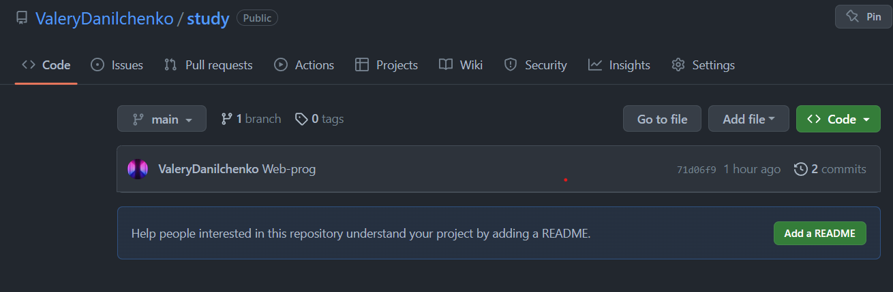
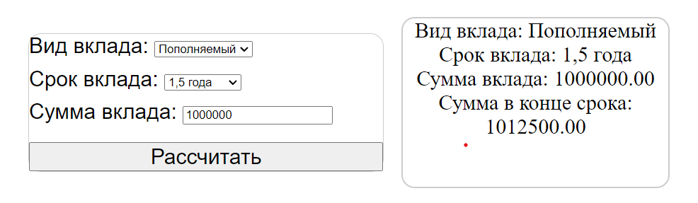

# Лабораторная работа: Работа с git, создание веб-страницы со слайдером и разработка калькулятора вкладов

## Выполнили студенты группы АВТ-013:
###   Данильченко В.С.
###   Чадоев И.М.
###   Баяндиева К.Б.
____  
В ходе данной работы были выполнены следующией задания:

## Задание 1. Работа с git и github

1. Зарегистрироваться на [github.com](https://github.com) и создать новый открытый репозиторий для данной лабораторной работы.
2. Подключить репозиторий к локальной папке с помощью git.

## Задание 2. Создание веб-страницы со слайдером изображений

1. Выбрать одну из библиотек для создания слайдера изображений:
   - [Swiper](https://swiperjs.com)
   - [Owl Carousel 2](https://owlcarousel2.github.io/OwlCarousel2/)
   - [Slick](https://kenwheeler.github.io/slick/)
2. Создать веб-страницу со слайдером изображений.
С помощью библиотеки  - [Swiper](https://swiperjs.com)

## Задание 3. Разработка калькулятора вкладов

1. На странице был разработан калькулятор вкладов для банка.

2. Реализовать выбор вида вклада и срока вклада с помощью комбобоксов.
3. Реализовать расчет суммы вклада и вывод результата в текстовом поле.

## Завершение работы

Результаты представленны в - [репозитории](https://github.com/ValeryDanilchenko/study)