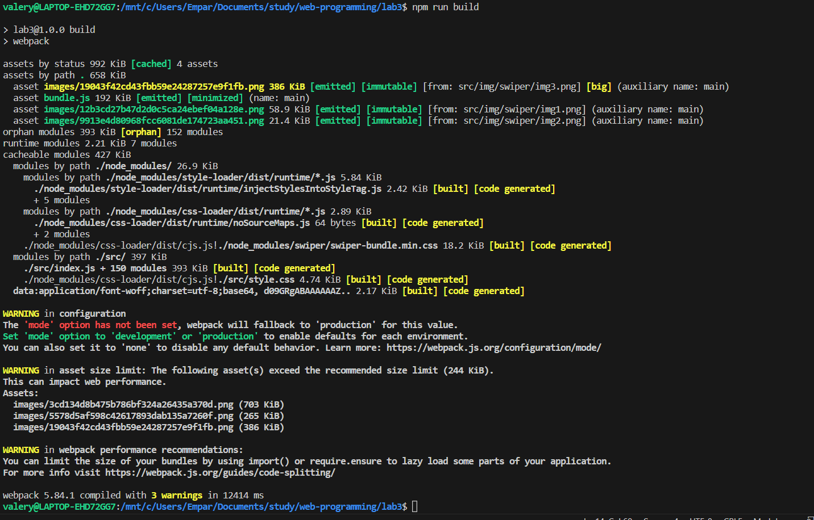
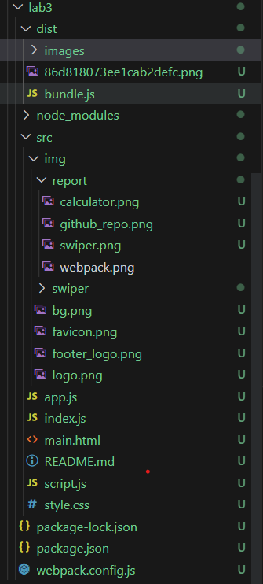
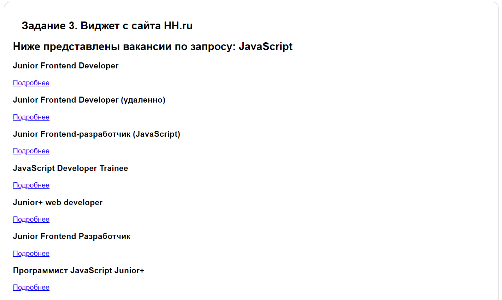

# Лабораторная работа 3: Использование npm, webpack и REST API

## Выполнили студенты группы АВТ-013:
###   Данильченко В.С.
###   Чадоев И.М.
###   Баяндиева К.Б.
____  
В ходе данной работы были выполнены следующией задания:

## Задание 1. Работа с git и github

1. Установить  настроить webpack
2. Мигрировать задание из Лабороторной работы №2 в окружение webpack

## Задание 2. Использование REST API

1. Напишите простой виджет, отображающий результаты поиска вакансий на сайте hh.ru с использованием его API: см.

   - [hh.ru/api](https://github.com/hhru/api/blob/master/docs/vacancies.md#search)
   - [Node.js](https://nodejs.dev/learn/making-http-requests-with-nodejs)
   - [Axios](https://github.com/axios/axios)
2. Создать веб-страницу со слайдером изображений.
С помощью библиотеки  - [Swiper](https://swiperjs.com)

## Завершение работы

Результаты представленны в - [репозитории](https://github.com/ValeryDanilchenko/study/)
